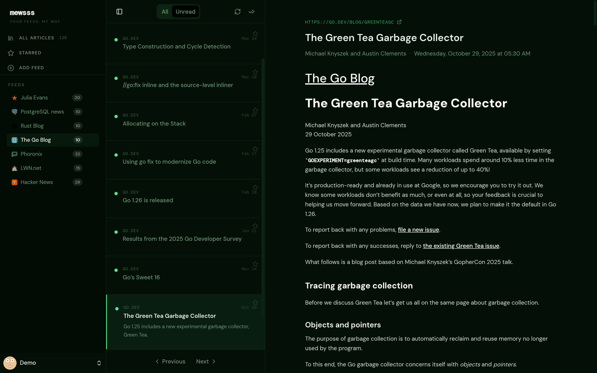
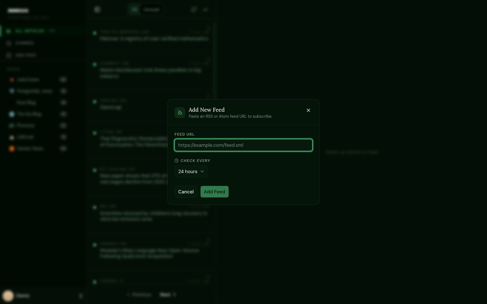

# mewsss

A self-hosted RSS reader. Three services and a Postgres database: a Go daemon that fetches feeds on a schedule, a TypeScript API that serves them, and a React client whose nginx also proxies `/api`, so the whole app is same-origin on one published port. One `docker compose up` brings it online.

I have been running it on my homelab since February 2026 against about 30 feeds and roughly 11,000 stored articles.

<p align="center">
  
</p>

## Installation

Both paths use the same `docker-compose.prod.yaml` and the same `.env`. They differ only in where the images come from.

Start with the configuration either way:

```sh
cp env.prod.example .env
```

Then edit `.env`. Three values matter:

- `MEWSS_PUBLIC_URL` — the URL you actually type into the browser. Use the host's LAN IP rather than `localhost` if you want to reach it from other machines, and keep the port in sync with `MEWSS_PORT`. Session cookies and Better Auth's trusted-origin check are both derived from this, so a mismatch shows up as login failing without an obvious error.
- `BETTER_AUTH_SECRET` and `INTERNAL_API_SECRET` — generate each with `openssl rand -hex 32`.

### arm64 (Raspberry Pi)

Published images are built for `linux/arm64`, so there is nothing to compile:

```sh
docker login gitea.15092021.xyz
docker compose -f docker-compose.prod.yaml pull
docker compose -f docker-compose.prod.yaml up -d
```

### Any other architecture

No Dockerfile changes are needed — Docker builds for the host's own architecture by default. Clone the repo and swap `pull` for `build`:

```sh
docker compose -f docker-compose.prod.yaml build
docker compose -f docker-compose.prod.yaml up -d
```

This takes a few minutes the first time, mostly the API's type-check and the client's Vite build. No registry login is required, since nothing is pulled.

If you would rather publish multi-arch images than build locally, the CI workflow accepts a `platforms` input via `workflow_dispatch` (for example `linux/amd64,linux/arm64`). Be aware that on an arm64 runner the amd64 half is emulated through QEMU and is substantially slower — that cost is the reason the default is arm64-only.

### Afterwards

The app is served on `MEWSS_PORT` (default `8080`). Only the client is published to the host; it proxies `/api` to the API over an internal network, so the whole app is same-origin behind that one port.

The scheduler owns the database schema and runs migrations on startup, so it needs to come up before the API — the compose file already encodes that ordering.

Add feeds from the sidebar. The refresh interval is per feed, and the scheduler will not go below five minutes on any of them:

<p align="center">
  
</p>

If a feed's password or database volume ever gets out of sync — say you change `POSTGRES_PASSWORD` on a stack that already has a volume — the scheduler is the service that tells you. It exits and restarts on a failed connection, while the API keeps reporting healthy, so `docker compose ps` is worth a look before assuming an empty article list means empty feeds.


---

Developed on a self-hosted [Gitea](https://gitea.15092021.xyz/pratik/mewsss) that runs in
my homelab; the copy on GitHub is a read-only mirror of it, pushed on every commit.
Issues and pull requests are welcome on the GitHub side and I will port them across.
